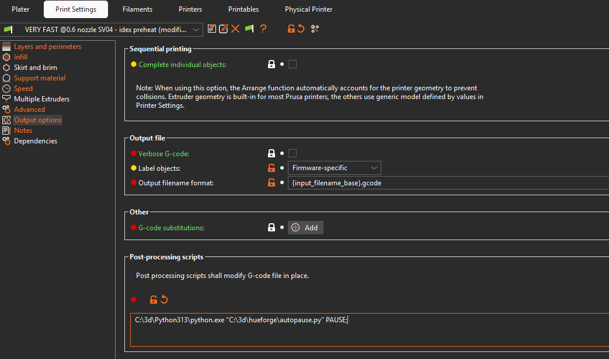
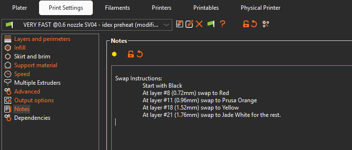

# HueForge Slicer Integration

Automate and simplify layer change pauses for HueForge prints with a post-processing Python script that inserts pause commands automatically.

## Overview

HueForge prints require precise color changes at specific layer heights. Manually inserting pauses in the slicer can be error-prone and time-consuming.
This tool automates that process based on data provided by HueForge and automatically adds filament change or pause commands at the correct layers.

## Features

- Automatically handles color-change layers in G-code 
- Inserts pause commands such as M600 or custom commands like PAUSE
- Tested with PrusaSlicer — should also work with OrcaSlicer and other slicers that support post-processing scripts

## Installation

1. Download [autopause.py](https://github.com/merkisoft/hueforge-slicer-integration/raw/refs/heads/main/autopause.py) (right click, Save link as ...) and place the script in a convenient folder.
1. In your slicer, open Printer Settings → Output options → Post-processing scripts. Add the path to your Python executable and the script file, for example:
   - Default M600 command: path_to_python\python.exe path_to_file\autopause.py
   - Custom command (Klipper): path_to_python\python.exe path_to_file\autopause.py PAUSE

## Usage

1. In the folder where you saved the project.hfp file, you will find project_describe.txt (where project is the name of your file). Open this text file and copy the section titled Swap Instructions:.
1. Add the color changes in the slicer’s Print Settings → Notes section (Prusa).
1. Export or directly print your model — the script will be run by the slicer and automatically insert pause commands where needed.

### Error situations

The script will only work if:
- You set the layer heights correctly — it must be able to find the corresponding layers.
- You add the full section Swap Instructions: (including this title).

Any errors will be shown in the script console for 60 seconds.

## Credits

- Created by Fabian Merki, merkisoft.ch
- Special thanks to Stephen Lavedas, HueForge, for the collaboration.
